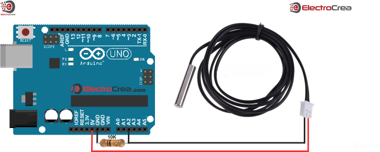
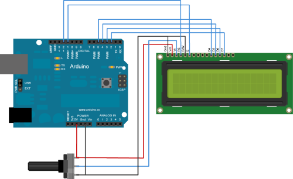

# :hotsprings: Termômetro Digital
## Projeto de Aula Experimental para Termodinâmica Aplicada
### *Prof. Lúcio P. Patrocínio*
***
## :dart:Objetivos
+	Desenvolver um termômetro digital básico utilizando a plataforma Arduino e sensores de temperatura NTC.
+	Realizar medidas básicas de temperatura.

## :notebook: Considerações Iniciais
Temperatura é uma grandeza física que mensura a energia cinética média de cada grau de liberdade de cada uma das partículas de um sistema em equilíbrio térmico. A Lei Zero da Termodinâmica afirma que, se dois corpos estão em equilíbrio térmico com um terceiro corpo eles também estão em equilíbrio térmico entre si. Ao substituir o terceiro corpo por um termômetro, a lei zero pode ser reescrita como dois corpos estão em equilíbrio térmico se ambos tiverem a mesma leitura de temperatura, mesmo que não estejam em contato.
Neste experimento utilizaremos um notebook, uma placa arduino UNO, sensores de temperatura NTC de 10 kohm (beta = 3470), e uma tela LCD JHD162A para realizar medidas de temperatura.  
A placa Arduino é um microcontrolador de placa única baseado em um processador denominado Atmel AVR com suporte de entrada e saída para sinais digitais e analógicos. A placa arduino UNO é capaz de receber sinais digitais ou analógicos e processá-los. Para isso, a placa precisa ser programada previamente utilizando software próprio.
Uma vez que a placa esteja fisicamente ligada ao sensor de temperatura e previamente programada, será capaz de receber os sinais de temperatura e interpretá-los adequadamente. A tela de LCD (cristal líquido) será incluída no projeto para realizar a apresentação do valor numérico da temperatura a medida em que for coletada pelo sensor.

## :nut_and_bolt: Material Necessário
+	01 Notebook
+	01 Protoboard
+	01 Placa Arduino UNO R3
+	Fios tipo jumpers
    +	Macho-macho
    +	Macho-fêmea
    +	Fêmea-fêmea
+	01 Sensor de temperatura NTC 10kohm±1%
+	01 Tela LCD JHD162A.
+	01 Potenciômetro de 10 kohm
+	01 Resistência de 470 ohm 
+	01 Resistência de 10 kohm
+	01 Cabo USB


## :construction_worker: Procedimento 
### **Etapa 1**: *Conectando o sensor de temperatura a placa Arduino*
1. Efetuamos a montagem do sensor de temperatura NTC e da resistência de 10 kohm na protoboard conforme esquema abaixo.


>    Observação sobre as conexões efetuadas na protoboard e na placa Arduíno:
>    + Saída de 5V do Arduíno ligada a um dos soquetes do sensor de temperatura.
>    + Resistor de 10 kohm ligado ao terra (GND) do Arduíno ao outro soquete do sensor de temperatura e em paralelo ligado a porta analógica A2 do Arduíno.

2. Procedemos a um teste com o sensor NTC utilizando o ambiente de desenvolvimento Arduino, o qual deve ser previamente instalado no notebook (ou computador).
3. No ambiente de desenvolvimento criamos um arquivo com a codificação abaixo, o qual deverá ser compilado e enviado para o arduino através de um cabo USB.
```
int ThermistorPin = 2;
int Vo;
float R1 = 10000;
float logR2, R2, T, Tc, Tf;
float c1 = 1.009249522e-03, c2 = 2.378405444e-04, c3 = 2.019202697e-07;

void setup() {
Serial.begin(9600);
}

void loop() {

  Vo = analogRead(ThermistorPin);
  R2 = R1 * (1023.0 / (float)Vo - 1.0);
  logR2 = log(R2);
  T = (1.0 / (c1 + c2*logR2 + c3*logR2*logR2*logR2));
  Tc = T - 273.15;

  Serial.print("Temperature: "); 
  Serial.print(Tc);
  Serial.println(" C");   

  delay(500);
}
```

4. Se o procedimento de montagem até este ponto estiver correto, a janela serial do arduino será capaz de apresentar um valor de temperatura (°C) próximo ao do valor ambiente.

### Etapa 2: *Incluindo um display LCD para apresentação da temperatura coletada pelo sensor.*

5. Vamos proceder a inclusão de um display LCD (cristal líquido) para apresentação dos resultados de temperatura coletados pelo sensor de temperatura. A imagem abaixo ilustra apenas o Arduíno e o LCD para facilitar a visualização das ligações. Observe que os elementos colocados na etapa 1 devem continuar no projeto. A orientação das ligações no display de LCD será numerada da direita para a esquerda.
   


>    Observação sobre as conexões efetuadas na protoboard e na placa Arduíno:
>    + Terminal 16 do LCD é ligado ao terra (GND) do Arduino.
>    + Terminal 15 do LCD é ligado a fonte de 5 V e ao terminal esquerdo do potenciômetro de 10 kohm.
>    + Terminal 14 do LCD é ligado ao terminal central do potenciômetro de 10 kohm.
>    + Terminal 13 do LCD é ligado a portal digital 12 do ARDUINO.
>    + Terminal 12 do LCD é ligado ao terminal direito do potenciômetro de 10 kohm.
>    + Terminal 11 do LCD é ligado a portal digital 11 do ARDUINO.
>    + Terminal 3 do LCD é ligado a portal digital 2 do ARDUINO.
>    + Terminal 4 do LCD é ligado a portal digital 3 do ARDUINO.
>    + Terminal 5 do LCD é ligado a portal digital 4 do ARDUINO.
>    + Terminal 6 do LCD é ligado a portal digital 5 do ARDUINO

6. No ambiente de desenvolvimento criamos um arquivo com a codificação abaixo, o qual deverá ser compilado e enviado para o Arduíno através de um cabo USB.
```
#include <LiquidCrystal.h>


int ThermistorPin = 2;

LiquidCrystal lcd(12, 11, 5, 4, 3, 2);

void setup() {
  lcd.begin(16,2);
  Serial.begin(9600);
}

void loop() {
  
  // coleta o dado de temperatura do SENSOR NTC
  float temperature = calcTemp();
   
  // Apresenta os dados coletados na saída serial 
  mostraTempSerial(temperature);
  
  // Apresenta os dados coletados no display do LCD
  mostraTempLCD(temperature);
  
  // Aguarda 1 segundo para uma nova coleta de dados
  delay(2000);
}


// Calcula a temperatura 
float calcTemp(){
  int Vo;
  float R1 = 10000;
  float logR2, R2, T, Tc, Tf;
  float c1 = 1.009249522e-03, c2 = 2.378405444e-04, 
      c3 = 2.019202697e-07;

  Vo = analogRead(ThermistorPin);
  R2 = R1 * (1023.0 / (float)Vo - 1.0);
  logR2 = log(R2);
  T = (1.0 / (c1 + c2*logR2 + c3*logR2*logR2*logR2));
  Tc = T - 273.15;
  return Tc;
}


// Apresenta a temperatura no monitor serial
void mostraTempSerial(float temperature){

  Serial.print("Temperatura no Sensor eh: ");
  Serial.print(temperature);
  Serial.println("*C");
}

// Apresenta a temperatura no display de LCD
void mostraTempLCD(float temperature)
{
  lcd.clear();
  lcd.setCursor(0,0);
  lcd.print("Termômetro NTC");
  lcd.setCursor(0,1);
  lcd.print("Temp = ");
  lcd.print(temperature);
  lcd.print(" *C");
}
```

### Etapa 3: *Utilização do sensor de temperatura* 

7. Efetue a medida de temperatura da temperatura ambiente utilizando o sensor NTC e um termômetro comum. Desconecte a placa arduino do computador e meça a resistência do sensor NTC. Preencha a tabela 1 abaixo com os dados das medidas.
8. Efetue a medida de temperatura da água fervendo utilizando o sensor NTC e um termômetro comum. Desconecte a placa arduino do computador e meça a resistência do sensor NTC. Preencha a tabela 1 abaixo com os dados das medidas.
9. Efetue a medida de temperatura do elo derretendo utilizando o sensor NTC e um termômetro comum. Desconecte a placa arduino do computador e meça a resistência do sensor NTC. Preencha a tabela 1 abaixo com os dados das medidas.

**Tabela 1** - *Dados coletados na Etapa 3*. 

| Situação | Variável | 1ª. medida | 2ª. medida | 3ª. medida | Média |
|---|---|---|---|---|---|
| Temp. Ambiente | Temperatura do termômetro (°C) |   |   |   |   |
|   | Temperatura do Sensor NTC (°C) |   |   |   |   |
|   | Resistência do sensor NTC |   |   |   |   |
| Gelo derretendo | Temperatura do termômetro (°C) |   |   |   |   |
|   | Temperatura do Sensor NTC (°C) |   |   |   |   |
|   | Resistência do sensor NTC |   |   |   |   |
| Agua fervendo | Temperatura do termômetro (°C) |   |   |   |   |
|   | Temperatura do Sensor NTC (°C) |   |   |   |   |
|   | Resistência do sensor NTC |   |   |   |   |


### Etapa 4: *Análise dos dados coletados*

10. Pesquise e responda as seguintes questões:
    - *Os valores obtidos para as temperaturas pelo sensor NTC coincidiram com aquelas obtidas pelo termômetro do laboratório? Em caso negativo, qual o maior erro relativo cometido?*
    - *Como podemos usar a equação de Steinhart-Hart para determinar a equação da temperatura em função da resistência? E se estivermos usando o Arduíno, como podemos relacionar a tensão na porta analógica com o valor da temperatura?*
    - *Como podemos usar a equação do fator Beta para determinar a temperatura em função do valor da Resistência? E se estivermos usando o Arduíno, como podemos relacionar a tensão na porta analógica com o valor da temperatura?*

   

## :books: Referências
+ NUSSEY, J. Arduino para Leigos. Rio de Janeiro: Alta Books, 2019.
+ McROBERTS, M. Arduino Básico. São Paulo: Novatec Editora, 2011.
+ KARVINEN, Kimmo; KARVINEN, Tero. Primeiros passos com sensores: perceba o mundo usando eletrônica, arduino e raspberry pi. Novatec Editora, 2014.
+ ELETROGATE. Termistor NTC para controle de temperatura. Acessado em 28/09/2023 em https://blog.eletrogate.com/termistor-ntc-para-controle-de-temperatura/.
+ [Calibração de sensor NTC](https://www.studocu.com/pt-br/document/universidade-federal-do-maranhao/calculo-de-reatores-quimicos/calibracao-de-um-termistor-ntc/15852537)
+ [NTC Thermistors Steinhart and Hart Equation](https://www.ametherm.com/thermistor/ntc-thermistors-steinhart-and-hart-equation)

